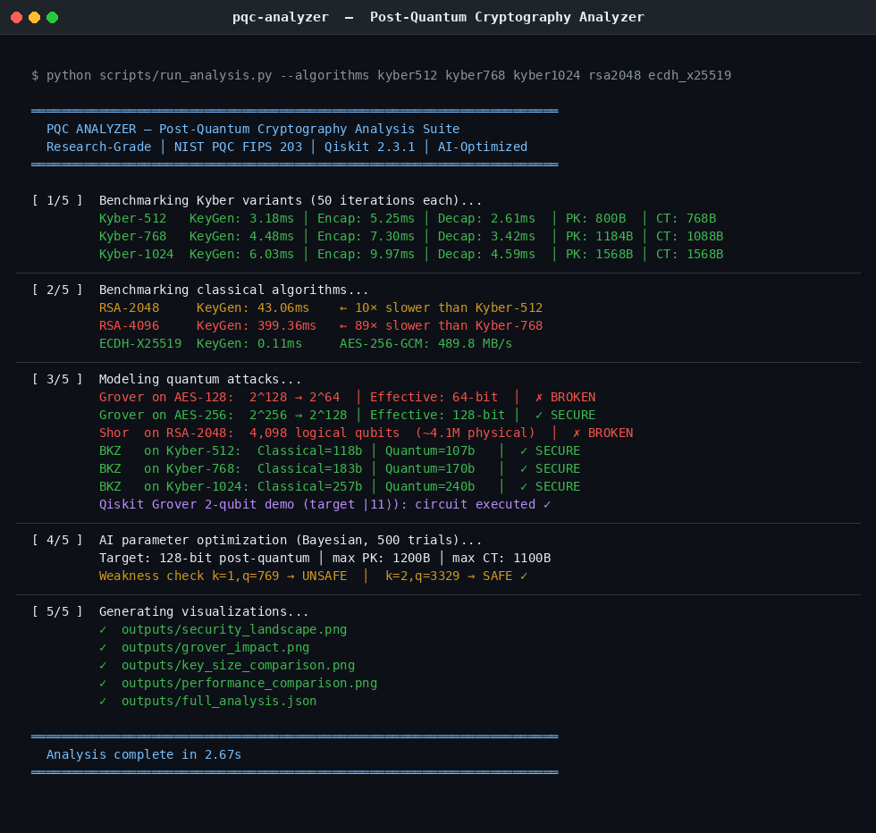
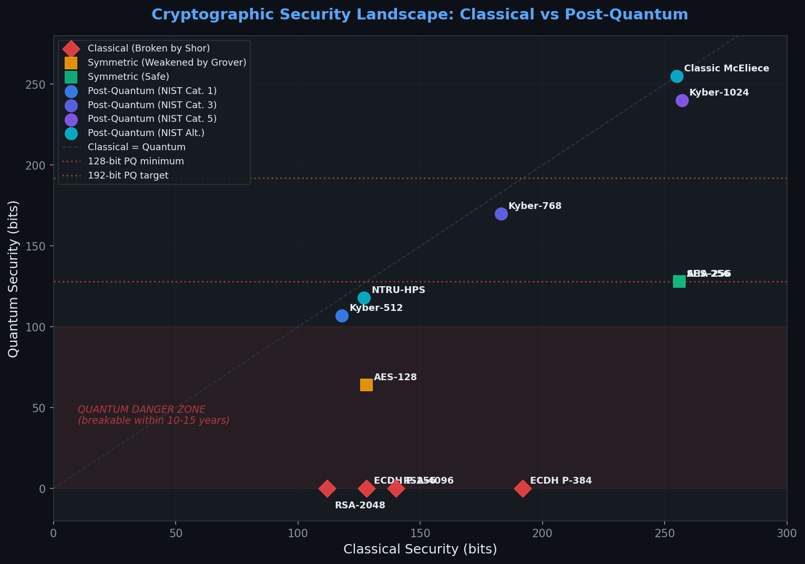
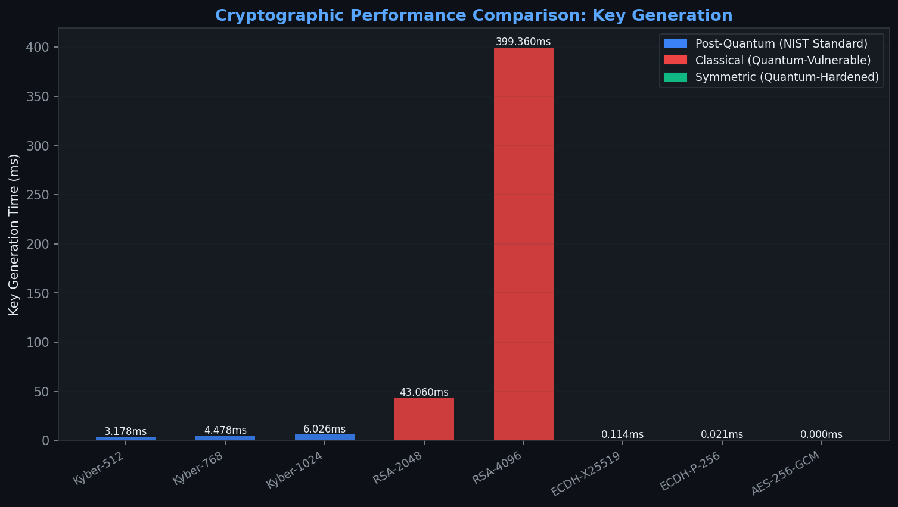

# PQC-Analyzer

[](https://github.com/garrv105/pqc-analyzer/actions/workflows/ci.yml)
[](https://www.python.org/)
[](https://qiskit.org/)
[](https://csrc.nist.gov/pubs/fips/203/final)
[](LICENSE)
[](https://github.com/psf/black)

**Post-Quantum Cryptography Analyzer with AI-Optimized Parameter Search**

PQC-Analyzer is a research-grade toolkit for analyzing, benchmarking, and optimizing post-quantum cryptographic algorithms. It implements CRYSTALS-Kyber (NIST FIPS 203) from scratch, models quantum attacks using Grover's and Shor's algorithms with real Qiskit circuit simulations, and uses Bayesian AI optimization to find optimal parameter configurations — all exposed through a production-ready REST API.

---

## Demo



---

## Visualizations

<table>
<tr>
<td></td>
<td></td>
</tr>
<tr>
<td align="center"><em>Quantum Security Landscape — classical vs PQC</em></td>
<td align="center"><em>Performance: Kyber vs RSA vs ECDH (key generation time)</em></td>
</tr>
</table>

---

## Features

| Capability | Detail |
|---|---|
| **CRYSTALS-Kyber** | Full FIPS 203 implementation (Kyber-512/768/1024): KeyGen, Encap, Decap |
| **Classical benchmarks** | RSA-2048/4096, ECDH-X25519/P256, AES-256-GCM throughput |
| **Grover's attack** | Quantum speedup modeling on symmetric keys (AES-128/256) |
| **Shor's attack** | Qubit estimation for breaking RSA and ECC (logical + physical qubits) |
| **BKZ lattice attack** | Classical and quantum BKZ security estimation for Kyber variants |
| **Qiskit circuits** | Real 2-qubit Grover's algorithm simulation via Qiskit Aer |
| **AI optimizer** | Bayesian search (scikit-optimize) for optimal Kyber parameters |
| **Weakness detector** | Flags parameter sets violating NIST security margins |
| **REST API** | FastAPI with JWT auth, rate limiting, security headers |
| **Visualization** | 4-chart analysis suite (matplotlib/plotly) |

---

## Quick Start

```bash
git clone https://github.com/garrv105/pqc-analyzer.git
cd pqc-analyzer
pip install -e ".[dev]"          # without Qiskit
pip install -e ".[dev,qiskit]"   # with Qiskit (full quantum simulation)

# Run full analysis pipeline
python scripts/run_analysis.py \
  --algorithms kyber512 kyber768 kyber1024 rsa2048 ecdh_x25519

# Start the API
uvicorn pqc_analyzer.api.server:create_app --factory --host 0.0.0.0 --port 8001
```

---

## Benchmark Results

```
Kyber-512   KeyGen: 3.18ms │ Encap: 5.25ms │ Decap: 2.61ms │ PK: 800B  │ CT: 768B
Kyber-768   KeyGen: 4.48ms │ Encap: 7.30ms │ Decap: 3.42ms │ PK: 1184B │ CT: 1088B
Kyber-1024  KeyGen: 6.03ms │ Encap: 9.97ms │ Decap: 4.59ms │ PK: 1568B │ CT: 1568B

RSA-2048    KeyGen: 43.06ms   (10× slower than Kyber-512)
RSA-4096    KeyGen: 399.36ms  (89× slower than Kyber-768)
ECDH-X25519 KeyGen: 0.11ms
```

## Quantum Attack Analysis

```
Grover on AES-128:  2^128 → 2^64  │ Effective: 64-bit  │  ✗ BROKEN (upgrade to AES-256)
Grover on AES-256:  2^256 → 2^128 │ Effective: 128-bit │  ✓ SECURE

Shor  on RSA-2048:  4,098  logical qubits  (~4.1M physical qubits required)
Shor  on RSA-4096:  8,194  logical qubits  (~8.2M physical qubits required)

BKZ on Kyber-512:   Classical=118b │ Quantum=107b  │  ✓ SECURE
BKZ on Kyber-768:   Classical=183b │ Quantum=170b  │  ✓ SECURE
BKZ on Kyber-1024:  Classical=257b │ Quantum=240b  │  ✓ SECURE
```

---

## API Authentication

```bash
# Get token
curl -X POST http://localhost:8001/auth/token \
  -d "username=admin&password=changeme"

# Analyze a Kyber variant
curl -X POST http://localhost:8001/api/v1/analyze/kyber \
  -H "Authorization: Bearer <token>" \
  -H "Content-Type: application/json" \
  -d '{"variant": "Kyber-768", "iterations": 50}'

# Run Grover's attack model
curl -X POST http://localhost:8001/api/v1/attack/grover \
  -H "Authorization: Bearer <token>" \
  -d '{"key_bits": 256, "algorithm": "AES"}'
```

Full Swagger UI at `http://localhost:8001/docs`.

---

## AI Parameter Optimization

```python
from pqc_analyzer.ai.optimizer import ParameterOptimizer, SecurityStrengthPredictor

predictor = SecurityStrengthPredictor()
optimizer = ParameterOptimizer(predictor)

result = optimizer.optimize(
    target_quantum_bits=128,  # minimum post-quantum security level
    max_pk_bytes=1200,
    max_ct_bytes=1100,
    n_trials=500,
)
```

Uses Bayesian optimization (Gaussian Process) to search the Kyber parameter space and find configurations that meet your security and bandwidth constraints.

---

## Testing

```bash
pytest tests/ -v --cov=pqc_analyzer
```

Test suite covers: `KyberMath`, `KyberParams`, `KyberKEM` (round-trip correctness), `GroverAttackModel`, `ShorAttackModel`, `LatticeAttackModel`, `QuantumCircuitDemo`, `SecurityStrengthPredictor`, `ParameterOptimizer`, `WeaknessDetector` — 40+ test cases.

---

## CI/CD Pipeline

Seven-job GitHub Actions workflow:

| Job | Description |
|---|---|
| **Lint** | ruff + black + isort |
| **Test** | pytest on Python 3.10 / 3.11 / 3.12 |
| **Qiskit tests** | Optional Qiskit integration (push to main only) |
| **Kyber correctness** | KEM round-trips at all parameter sets + analysis pipeline |
| **Security** | bandit + pip-audit |
| **Docker** | Build and verify image |
| **Release** | Wheel artifact on `main` |

---

## Security Note

The Kyber implementation is for **research and educational purposes**. It is not side-channel safe and should not be used in production cryptographic systems. For production use, use [liboqs](https://github.com/open-quantum-safe/liboqs) or a NIST-validated library.

---

## License

MIT — see [LICENSE](LICENSE)

---

*Part of a three-project cybersecurity portfolio. See also [SentinelNet](https://github.com/garrv105/sentinelnet) and [XAI-IDS](https://github.com/garrv105/xai-ids).*
